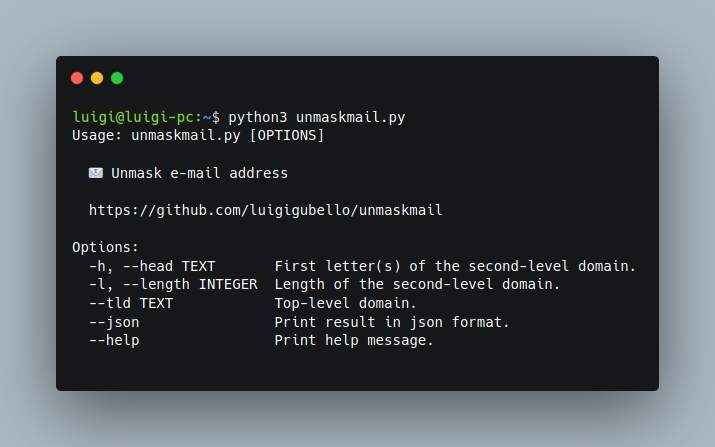

# 📧 Unmask Mail

*Unmask Mail* is a Python script to easily list the possible e-mail domains hidden behind the asterisks.

> **Note:** *This tool is an alpha version, so consider it unstable.*

## 📦 Installation

1. Install the requirements using `pip`
   
   ```
   pip3 install -r requirements.txt --user
   ```

2. Launch the python script
   
   ```
   python3 unmaskmail.py
   ```

## ℹ️ Usage

To get the list of commands

```
python3 unmaskmail.py --help
```

### Example

**Input:**
```
python3 unmaskmail.py --head pr --length 10 --json
```

**Output:**
```
{"result": ["prontomail.com", "progetplus.it", "programmer.net", "promessage.com", "protonmail.com", "presidency.com", "programozo.hu"]}
```

## 🖼️ Screenshot


